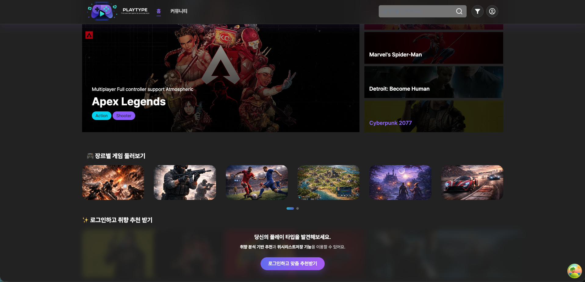
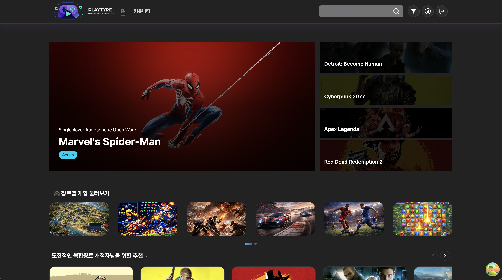
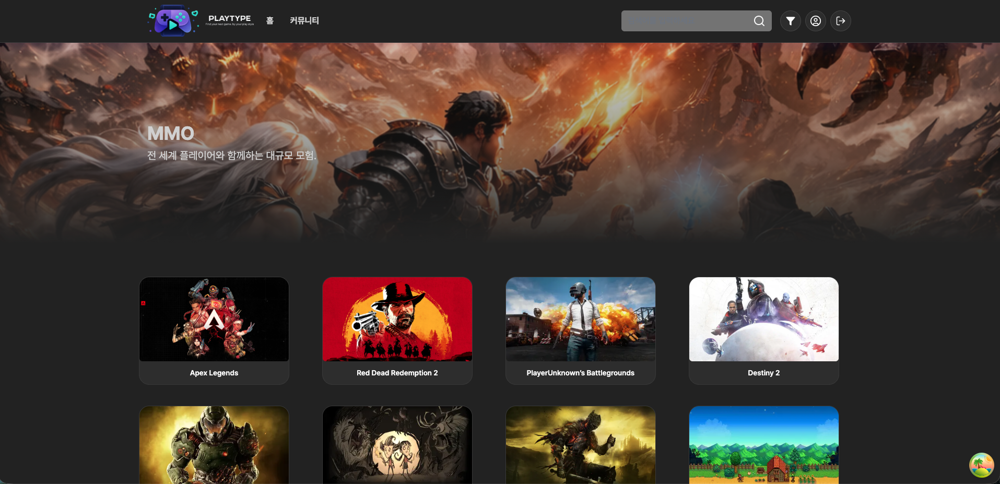
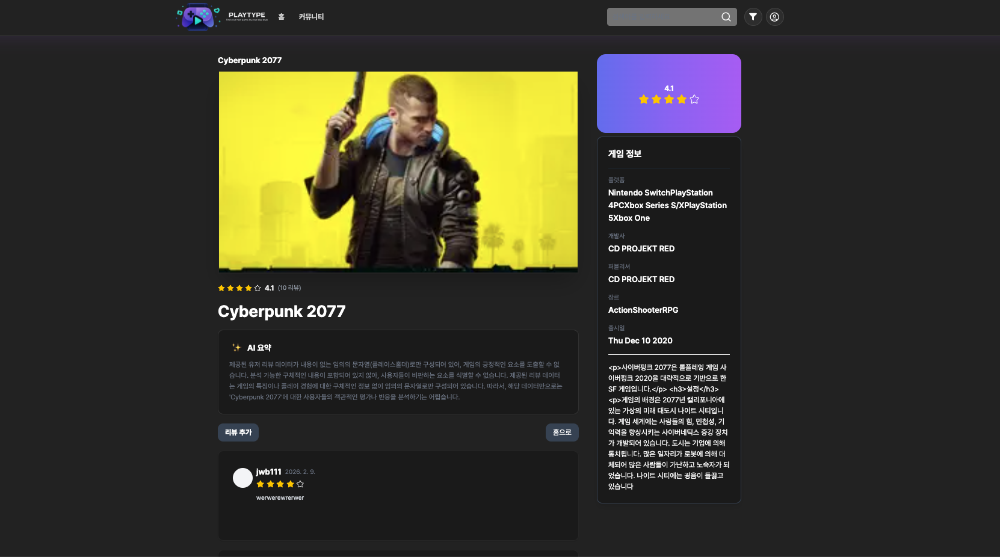

# 🎮 PLAYTYPE: 취향 기반 게임 추천 커뮤니티 플랫폼

당신의 선택이 플레이 스타일이 됩니다.

> 태그와 장르 선택을 기반으로 사용자의 성향을 분석하고 최적의 게임을 추천하는 서비스입니다.

---

## 📖 프로젝트 소개

> PLAYTYPE은 파편화된 게임 정보 속에서 사용자가 자신의 진정한 게임 취향을 발견하도록 돕습니다.
>
> 멀티 스텝 온보딩을 통해 플레이 성향을 도출하고, 이를 바탕으로 맞춤형 게임 추천 및 커뮤니티 경험을 제공합니다.

---

## 🎥 서비스 미리보기

### 🖥 데스크톱

**메인 페이지 / 온보딩 / 추천 흐름**
[회원가입]
<video controls src="회원가입.mov" title="Title"></video>

[회원수정]
<video controls src="회원정보수정.mov" title="Title"></video>

[회원탈퇴]
<video controls src="회원탈퇴1.mov" title="Title"></video>

[프로필수정]
<video controls src="프로필수정.mov" title="Title"></video>

[취향분석 온보딩]
<video controls src="onboarding-1.mov" title="Title"></video>
[메인페이지 - 로그인 전]


[메인페이지 - 로그인 후]


[장르별 상세페이지]


[리뷰상세페이지]


[리뷰 댓글 반응형]

---

### 📱 모바일

**모바일 최적화 UI 및 인터랙션**
{추가예정}

---

## 🌐 배포 링크

> ### 🔗 [Live Demo](oz-union-fe-14-team1-main.vercel.app)

---

## 🚀 Getting Started

### 저장소 클론

```bash
git clone https://github.com/oz-union-14-team1/oz-union-fe-14-team1.git

cd oz-union-fe-14-team1
```

### 환경 변수 설정

프로젝트 루트 디렉토리에 `.env` 파일을 생성하고 아래 내용을 추가합니다.

```env
NEXT_PUBLIC_API_BASE_URL=your_api_base_url_here
```

### 설치

```bash
pnpm install
```

### 개발 서버 실행

```bash
pnpm dev
```

### 테스트 계정

로그인이 필요한 기능(리뷰 작성, 커뮤니티 참여 등)을 아래 테스트 계정으로 바로 확인할 수 있습니다.

```bash
ID: test@playtype.com
PW: test1234
```

---

## ✨ 주요 기능

### 🎯 플레이타입 분석

- 태그 선택을 통한 플레이 성향 수집
- 장르 선택을 통한 게임 선호도 수집
- 백엔드 AI 기반 성향 분석 결과 수신
- 플레이타입별 설명 및 추천 기준 제공

```
1. 플레이타입 성향 분석 (핵심 기능)
선택 기반 성향 수집:
태그 및 장르 선택 데이터를 수집하여 사용자의 플레이 성향 정보를 구성

AI 기반 분석 연동:
수집된 데이터를 백엔드로 전달하여 AI 모델이 플레이 성향(tendency)을 분석

결과 매핑 및 노출:
분석 결과를 플레이타입으로 매핑하고 타입별 설명과 추천 기준을 UI로 제공
```

### 🎮 게임 추천 & 탐색

- 플레이타입 기반 맞춤 게임 추천
- 전체 게임 목록 조회
- 장르 / 연도 / 평점 기반 필터링
- 페이지네이션 기반 게임 리스트 탐색

```
맞춤 추천 제공:
플레이타입 결과를 기준으로 사용자에게 적합한 게임 리스트 제공

위시리스트 관리:
관심 있는 게임을 위시리스트에 추가 / 삭제하여 개인화된 게임 컬렉션 관리

다중 필터 조합:
장르, 연도, 평점 조건을 조합하여 게임 목록을 유연하게 탐색 가능

리스트 최적화:
페이지네이션 적용으로 대량의 게임 데이터를 효율적으로 처리
```

### 📄 게임 상세 정보

- 게임 상세 정보 조회
- 장르 및 태그 정보 시각화
- 관련 게임 및 커뮤니티 진입 유도

```
1. 게임 상세 정보 제공
게임의 핵심 정보(이미지, 장르, 태그)를 시각적으로 구분하여 제공

이용 흐름 설계:
상세 정보 확인 후 리뷰 및 커뮤니티로 자연스럽게 이동하도록 UX 구성
```

### 💬 리뷰 · 커뮤니티

- 게임별 리뷰 작성 / 수정 / 삭제
- 🤖 AI 기반 리뷰 요약 제공
- 리뷰 댓글 작성 및 사용자 간 소통
- 게임 중심 커뮤니티 구조 제공

```
1. 리뷰 기반 커뮤니티 기능
게임 중심 리뷰 구조:
각 게임을 기준으로 리뷰가 모이는 구조로 게임별 커뮤니티 경험 제공

AI 리뷰 요약:
게임별로 작성된 다수의 리뷰를 AI가 분석하여 핵심 의견을 요약 제공
사용자들이 빠르게 게임의 전반적인 평가를 파악할 수 있도록 지원

상호 소통 기능:
리뷰에 댓글을 남기고 좋아요 / 싫어요 반응을 통해 사용자 간 의견 표현 및 피드백 가능
```

---

## 🧰 기술 스택

<div>

#### Framework / Language


#### Styling / UI


#### State Management


#### Data / API


#### Code Quality / Dev Tools


#### 배포


</div>

---

## 👥 팀 소개

### FE

|          <a href="https://github.com/SammyLee519"><br/><sub><b>@SammyLee519</b></sub></a><br/>          |  <a href="https://github.com/WoongBaeJeon"><br/><sub><b>@WoongBaeJeon</b></sub></a><br/>  | <a href="https://github.com/sowonhub"><br/><sub><b>@sowonhub</b></sub></a><br/> | <a href="https://github.com/lollonoaJoro"><br/><sub><b>@lollonoaJoro</b></sub></a><br/> |
| :-----------------------------------------------------------------------------------------------------------------------------------------------------------------: | :----------------------------------------------------------------------------------------------------------------------------------------------------: | :--------------------------------------------------------------------------------------------------------------------------------------: | :--------------------------------------------------------------------------------------------------------------------------------------------------: |
|                                                                               이샘물                                                                                |                                                                         전웅배                                                                         |                                                                  김소원                                                                  |                                                                        김재민                                                                        |
|                                                                             팀장 (Lead)                                                                             |                                                                          팀원                                                                          |                                                                   팀원                                                                   |                                                                         팀원                                                                         |
| 메인 페이지 및 온보딩 추천 플로우 구현,<br/>플레이타입 분석 결과 기반 UI 설계,<br/>커뮤니티 페이지 구조 및 인터랙션 구현,<br/>공통 UI 패턴 정리 및 사용자 흐름 설계 | 인증 플로우 전반 구현 (로그인 / 회원가입),<br/>계정 찾기 및 회원 정보 수정·탈퇴 기능 구현,<br/>인증 관련 예외 처리 및 접근 제어,<br/>인증 UX 흐름 정리 | 마이페이지 플로우 구현,<br/>사용자 정보 조회 및 수정 UI 구현,<br/>검색 페이지 및 검색 결과 UX 구현,<br/>사용자 중심 정보 관리 화면 구성  |                   리뷰 페이지 구현,<br/>리뷰 상세 페이지 구현,<br/>리뷰 작성/수정/삭제 UX 구성,<br/>커뮤니티 내 리뷰 인터랙션 담당                   |

---

## 📑 프로젝트 규칙

> 자세한 내용은 각 문서를 참고해주세요.

| 문서                                      | 설명          |
| ----------------------------------------- | ------------- |
| [BRANCH.md](./docs/BRANCH.md)             | 브랜치 전략   |
| [COMMIT.md](./docs/COMMIT.md)             | 커밋 컨벤션   |
| [CONVENTION.md](./docs/CONVENTION.md)     | 코드 컨벤션   |
| [STRUCTURE.md](./docs/STRUCTURE.md)       | 프로젝트 구조 |
| [DESIGNSYSTEM.md](./docs/DESIGNSYSTEM.md) | 디자인시스템  |

---

## 🧪 코드 품질 관리

- **Husky** pre-commit 훅으로 린트 자동 실행
- **ESLint + Prettier** 일관된 코드 스타일 유지
- **GitHub Actions** CI / CD 자동화

---

## 🧩 Test Page (개발용)

- Storybook 대신 프로젝트 내부 테스트 페이지를 활용하여  
  실제 서비스 흐름 기반으로 컴포넌트 및 로직 검증
- UI 상태 변화 및 인터랙션을 페이지 단위로 확인

---

## 🔚 마무리

> **OZ Coding School Frontend Bootcamp**  
> **Team1 14기 합동 프로젝트**

<p align="right"><a href="#-playtype-취향-기반-게임-추천-커뮤니티-플랫폼">⬆️ Back to Top</a></p>
